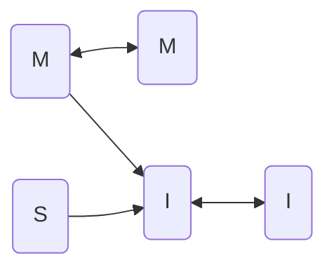
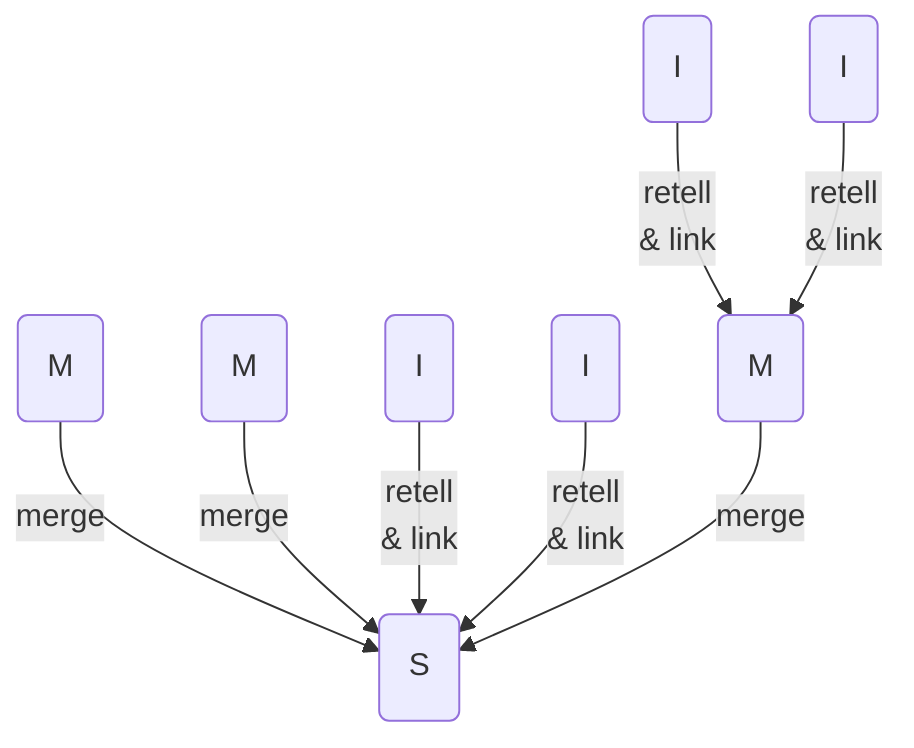

#sum #notes #image #public

* **Типы заметок**
	* **(I)mport**
		* цитаты и конспект источников
			* цитаты
			* цитаты + заголовки
			* список
			* диаграмма
				* выявляет пробелы, помогает задавать вопросы и дополнять картину
				* выявляет параллели и неочевидные связи
				* помогает разбирать материал и находить несоответствия
		* по одной заметке на источник
		* ссылаюсь на всю заметку или заголовки цитат
	* **(M)y**
		* мои мысли (+ пересказ источников)
	* **(S)ummary**
		* сбор моих мыслей и/или пересказа источников
		* по мере роста превращается в черновик текста
* **Разделение и объединение заметок**
	* объединяю заметки со своими мыслями, если они на одну тему и не хочу заводить новый тег
	* собирать заметки лучше в первую по дате, чтобы знать, когда идея появилась
	* разделять заметку стоит, если между частями нет причинно-следственных связей
* **Как писать тексты на основе заметок**
	* собирать материал
		* записывать все по теме в один файл по мере обработки источников
		* объединять уже написанные заметки
	* обрабатывать
		* группировать пункты
		* присваивать заголовки
		* выстраивать в нужном порядке
		* подгонять по стилю, чтобы складывалось в единое повествование
* **Ссылки**

* **Обобщение**

[^1]: [2021-1108-1808.Призрачный геном](2021-1108-1808.Призрачный%20геном.md)