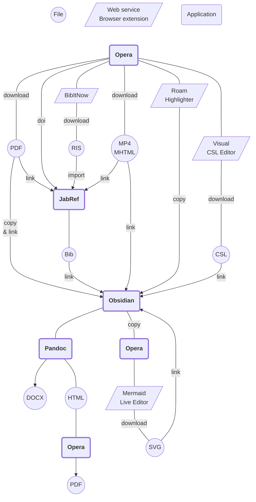

#sum #notes #image #public

* **Компьютер**
	* Opera (закладки и веб-страницы в mhtml) [^1]
		* Roam Highlighter (копировать цитаты веб-страниц)
		* Obsidian Web (сохранять цитаты веб-страниц и PDF в Обсидиан)
		* BibItNow (библиографические данные веб-страниц) [^2]
	* Adobe Acrobat/Reader
	* STDU Viewer (экспорт цитат из PDF)
	* Obsidian (заметки) [^3] [^4] [^5] [^6]
	* Notepad++ (массовая автозамена)
	* JabRef (данные об источниках) [^2]
	* Pandoc (экспорт в HTML и DOCX) [^7] [^8]
* **Мобильный**
	* Epsilon Notes (маркдаун-редактор)
		* компактный интерфейс
		* предпросмотр заметок
		* быстрая фильтрация по названию [^5]
		* если в обсидиане нельзя сослаться на заголовок, можно сослаться на абзац, потому что Epsilon все равно откроет файл по такой ссылке
	* ReadEra (экспорт цитат из PDF)
* **Синхронизация** [^9]
	* Dropbox на компьютере
	* Dropsync на мобильном
		* отключить автосинхронизацию и синхронизировать вручную, чтобы избежать конфликтов или откатиться, если удалить что-то не то
* **Сервисы**
	* Visual CSL Editor (стиль для списка источников)
	* Mermaid Live Editor (конвертация диаграмм в SVG)
	* Downsub (скачать субтитры с ютуба)
	* Save-from (скачать видео с ютуба)

[^1]: [Mhtml в Опере](2019-1101-0000.Mhtml%20в%20Опере.md)  
[^2]: [Источники](2022-0110-0052.Источники.md)  
[^3]: [Notes](2021-1228-1435.Notes.md)  
[^4]: [Заметки](2021-1105-2320.Заметки.md)  
[^5]: [Названия, вертикальные вкладки](2022-1019-1354.Названия,%20вертикальные%20вкладки.md)  
[^6]: [Лайфхаки](2022-1019-1437.Лайфхаки.md)  
[^7]: [Подготовка к экспорту](2022-1019-1118.Подготовка%20к%20экспорту.md)  
[^8]: [Экспорт](2022-0110-0052.Экспорт.md)  
[^9]: [Синхронизация](2021-0103-0000.Синхронизация.md)  